# Quectel_Quecthing_MCU仿真工具使用说明

## 1程序介绍
### 1.1.引言
MCU仿真工具是一款模拟主控MCU与移远模组间通讯的仿真助手，拥有连接云平台、AT指令交互、物模型数据交互、透传数据交互、OTA交互以及网关子设备数据交互等强大功能。调试日志功能和日志分析功能能有效地提高用户对模组或APP的功能认知，方便了用户对模组或APP能力的验证与调试从而提高了对整体方案的开发验收效率。
### 1.2.整体框架介绍
当前工具名称为移远MCU仿真工具，版本号为2.0.0。
* **工具栏**  
工具栏中的工具选项表示额外的工具（即非必要性功能，只为提高用户的使用效率、方便开发测试及验证等）使用场景：如TTLV互转JSON格式工具、多字符串界面工具等。  
工具栏中的tool选项表示对工具的更新检测，如存在新的版本则会提醒用户更新。  
工具栏中的帮助选项主要提供工具操作文档（即本文）。
* **输出界面**  
日志输出界面为工具连接上SDK或模组后，输出的日志并显示在界面上，以便用户查看相关的信息。   
日志分析界面是对日志输出界面中的AT指令进行解析，以帮助用户快速理解指令的格式与意义。  
日志输出设置目前存在HEX和关闭窗口显示两个功能。HEX按钮主要作用为输出日志中hex格式的数据；
* **功能栏**  
功能栏目前提供调试、配置、物模型、透传、OTA、信息、局域网与网关子设备八项功能，具体功能使用请参考2到10章节。
* **状态栏**  
状态栏可显示用户部分操作及操作结果的信息显示，主要为不影响程序整体运行的操作信息，若为重要信息，则会通过弹窗提示。

    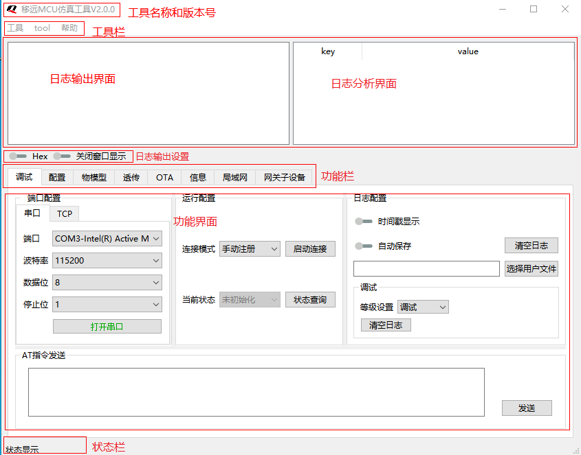
    
图1

## 2调试功能界面简介
切换到“调试”页面,显示如图 2。

    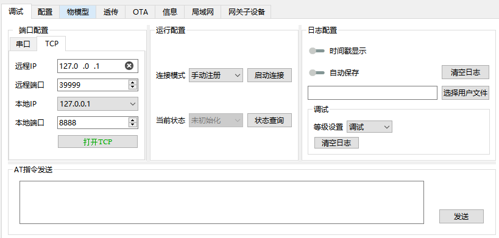
    
图2

### 2.1.日志窗口
如图 3所示，在使用过程中如需查看更多，可在方框底部往下拉控件则可拉伸显示。

    
    
图3

#### 2.1.1.日志显示

    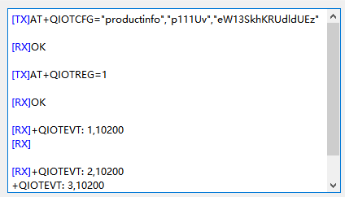
    
图4

**\<TX>：** 串口工具发送的数据。  
**\<RX>：** 串口工具接收到的数据。  
**时间戳显示：** 可通过“设备调试”界面中的“时间戳显示”进行打开或者关闭。  
**Hex：** 可将接收消息的16进制部分显示出来  
**关闭窗口显示：** 可关闭窗口显示，如sota操作等无需关注时，可使用此功能使得之前的命令不被覆盖，目前窗口只显示最近1000行的记录

#### 2.1.2.日志解析

    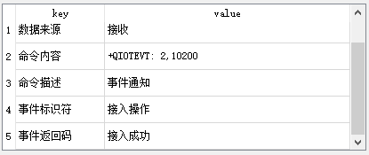
    
图5

通过在日志显示窗口点击对应的日志，会解析该日志AT指令的数据。
目前仅支持连接云平台相关的AT指令进行解析，其他AT指令不作处理。

#### 2.1.3.特别提示
若调试途中需要了解日志显示窗口的内容，可将鼠标移至日志显示窗口的下边框，按住鼠标左键往下拉，恢复则往上拉。
端口配置

### 2.2.串口配置

    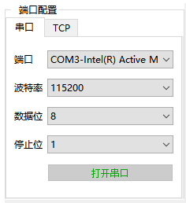
    
图6

选择对应的串口端口、波特率、数据位、停止位等参数。

**打开串口：** 串口被打开后，将无法修改串口配置，需要修改请先关闭串口。  
**关闭串口：** 若当前处于连接DMP平台的状态时，将会断开连接。

### 2.3.TCP配置
#### 2.3.1. 选择对应的远程IP和端口号以及本地的IP和端口号
限制远程IP的输入，仅可输入数字和’.’，同时需要符合IP格式，可点击右侧的’x’删除IP。
#### 2.3.2. 打开TCP 
**重连：** 该功能被选中后，若tcp连接不成功，则会重新3次。

#### 2.3.3.关闭TCP

    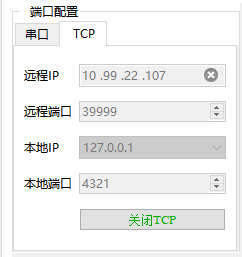
    
图7

### 2.4.运行配置

    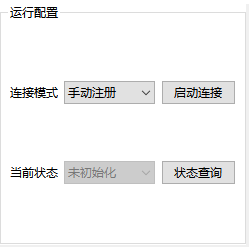
    
图8

#### 2.4.1.连接模式
选择启动模组云平台功能的连接模式。
**手动注册：** 手动发起连接IOT。
**自动注册：** 联网后主动连接IOT。
#### 2.4.2.当前状态
云平当前的连接状态：
* 未初始化
* 已初始化
* 正在认证
* 认证成功
* 认证失败
* 正在注册
* 注册成功
* 等待订阅
* 注册失败
* 已订阅
* 数据可发送
* 订阅失败
* 正在注销
* 注销成功
* 注销失败。

**启动连接：** 需要先打开串口，将使用选中的产品配置信息连接云平台。  
**停止连接：** 需要先打开串口，将断开云平台连接。

### 2.5.日志配置

    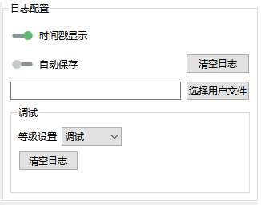
    
图9

#### 2.5.1.时间戳显示
打开显示后，串口收发日志中会添加时间戳显示。
#### 2.5.2.清空日志
点击按钮后将清空当前日志显示窗口的日志。
#### 2.5.3.自动保存日志
先点击“选择文件”按钮，再打开“自动保存”选项，后续日志显示窗口的数据都会自动保存到选择的文件中。
#### 2.5.4.调试的等级设置
等级设置为debug、info、warning、errno和dump五类，完成对debug日志输出控制。dmp文件为每次启动程序新建或覆盖，不保存前面的记录。
#### 2.5.5.清空调试日志
点击按钮后将清空debug日志。
### 2.6.AT指令发送

    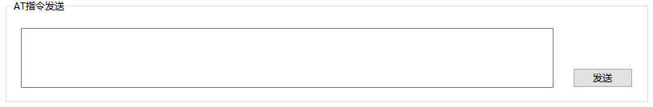
    
图10

用于发送AT指令。  
AT输入框存在历史记录。  
可通过输入部分通过提示框补全。

    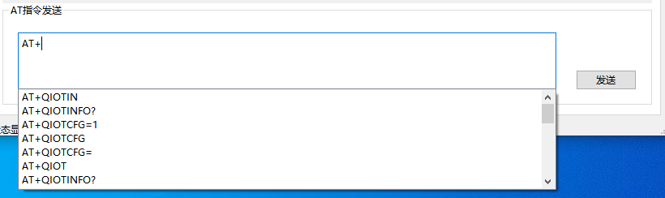
    
图11

## 3配置功能界面简介
切换到“配置”页面。

    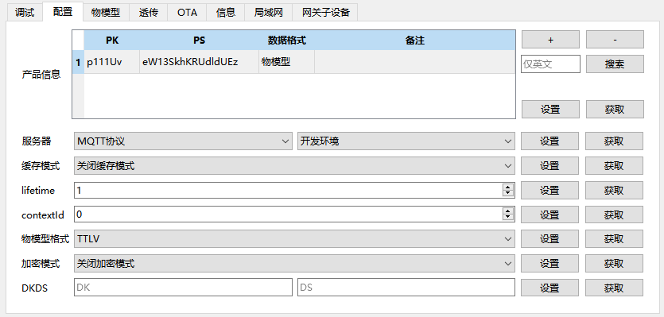
    
图12

### 3.1.添加产品配置信息
#### 3.1.1.切换到配置页面，点击按钮“+”
设立所有”+””-”,鼠标移动到相应位置有浮窗显示相应功能
#### 3.1.2.在弹出的新窗口中按需要输入产品配置信息
1. 产品配置信息页面，数据类型为透传数据

    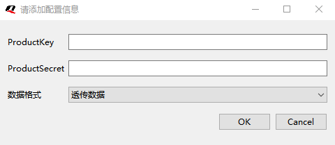
    
图13

>注：配置相应的PK和PS
2. 产品配置信息页面，数据类型为物模型数据

    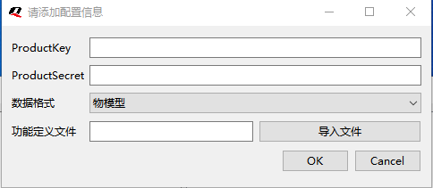
    
图14

>注：导入DMP或自定义的json文件，如json文件超过1M或者不合法，会出现错误
3. 点击按钮“OK”,保存产品配置信息，并如下图所示，显示在产品信息中。

    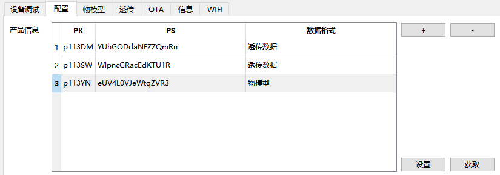
    
图15

### 3.2.删除产品配置信息
1. 切换到配置页面，通过光标选中需要删除的配置选项
2. 点击按钮“-”，删除选中的配置选项
3.2.3.弹出弹窗提示：“是否确定删除配置文件” 

    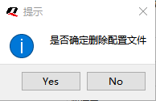
    
图16

4. 点击yes 删除，点击no则取消

### 3.3.切换产品配置信息
1. 切换到配置页面，通过光标选中需要使用的配置选项

    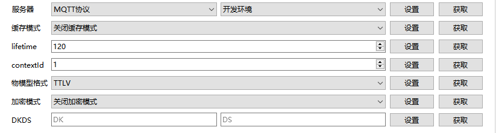
    
图17

**连接服务器支持两种协议：** MQTT协议和lwM2M协议   
**服务器环境：** 开发环境、fat2环境、fatb环境、生产环境（mqtt）只支持 mqtt ; 生产环境（http）只支持 http ; 其他请通过自定义添加  
**lifeTime：** 范围为（1 - 65535）  
**contextId：** 范围为（0 - 99）  
**物模型格式 ：** TTLV和JSON。  
**加密模式：** 是否在MQTT或HTTP基础上增加TLS加密服务。  
**DKDS:** 更改设备IMEI和设备密钥。  

## 4物模型功能界面简介  
切换到“物模型”页面。

    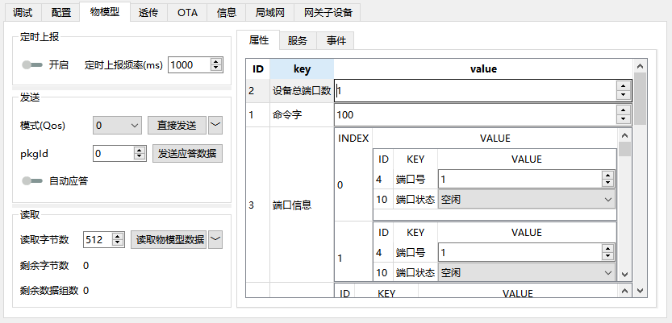
    
图18

### 4.1.物模型列表

    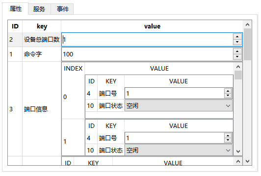
    
图19

1. 物模型列表中包含3个大类，属性类、服务类以及事件类。
2. 根据用户输入的产品配置信息生成对应的物模型列表，如果选择的数据通信方式是透传或者导入的json文件异常，则列表为空
### 4.2.发送

    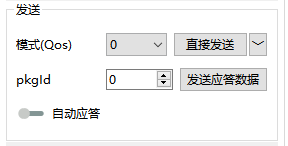
    
图20

#### 4.2.1.模式
* 0(发送一次)
* 1(发送多次，保证服务器至多收到一次)
* 2(发送多次，保证服务器至少收到一次)
#### 4.2.2.发送物模型数据
通过选择右侧物模型列表中数据进行物模型数据发送，支持单选/多选/全选。可点击最右上角的按钮选择“直接发送”/“透传发送”。
* **单选：** 直接通过光标选中单个物模型ID
* **多选：** 按住键盘“CRTL”+需要发送的多个物模型ID
* **全选：** 按住键盘“CRTL”+“A”  

#### 4.2.3.发送应答数据
通过选择右侧物模型列表中数据进行应答数据发送，支持单选/多选/全选。  
* **PkgId：** 云平台读取物模型ID的最新pkgId，也可以手动修改输入
* **单选：** 直接通过光标选中单个物模型ID
* **多选：** 按住键盘“CRTL”+需要发送的多个物模型ID
* **全选：** 按住键盘“CRTL”+“A”
#### 4.2.4.自动应答
打开该选项后，云平台读取物模型ID后，会自动应答对应的物模型ID到云平台
### 4.3.读取
仅当产品配置信息中缓存模式选择为“开启缓存模式”时有效，选择为“关闭缓存模式”时，接收到云平台数据会自动更新到右侧物模型列表。可点击最右上角的按钮选择“读取物模型数据”/“获取读取的最大值”。

    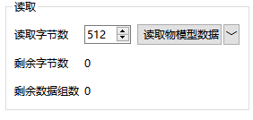
    
图21

* **读取物模型数据：** 根据设置的读取字节数进行物模型数据读取，并把读取到的数据更新到右侧的物模型列表。
* **剩余字节数：** 当前数据组剩下的字节数。
* **剩余数据组数：** 剩下的缓存数据组数。

### 4.4.定时上报
开启该选项后，工具将按照设定的上报频率，和右侧物模型ID列表中选中的ID进行定时上报。

    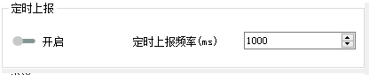
    
图22

* **定时上报频率：** 单位毫秒，最小上报间隔：1ms，最大为600 s
## 5透传功能界面简介
切换到“透传”页面。

    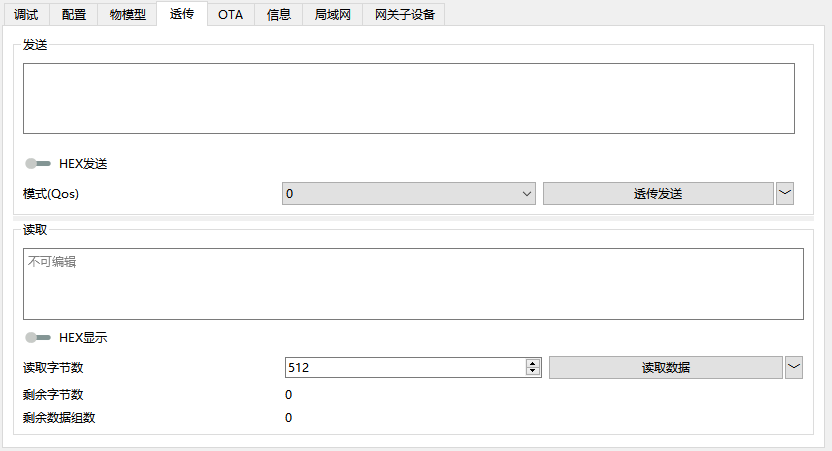
    
图23

### 5.1.发送
鼠标移动到输入框，提示最大只可输入4096个字节，同时内部也限制最大为4096字节输入。

    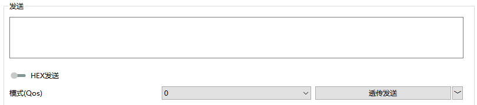
    
图24

* **HEX发送：** 该选项可以选择是上报字符串还是16进制字节流。
* **模式（Qos）：** 默认为0，更多可选择1、2。
* **发送方式：** 可通过右下角的“�濉毖≡瘛巴复�发送”/“直接发送”。

### 5.2.读取
仅当产品配置信息中缓存模式选择为“开启缓存模式”时有效，选择为“关闭缓存模式”时，接收到云平台数据会自动更新到透传数据显示窗口。

    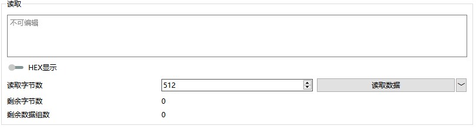
    
图25

 
* **读取数据：** 根据设置的读取字节数进行透传数据读取，并把读取到的数据更新到上方的透传数据显示窗口。
* **剩余字节数：** 当前数据组剩下的字节数。
* **剩余数据组数：** 剩下的缓存数据组数。
* **发送方式：** 可通过右下角的“�濉毖≡瘛岸寥∈�据”/“获取读取数据的最大值”。
## 6 OTA功能界面简介
切换到“OTA”功能界面。

    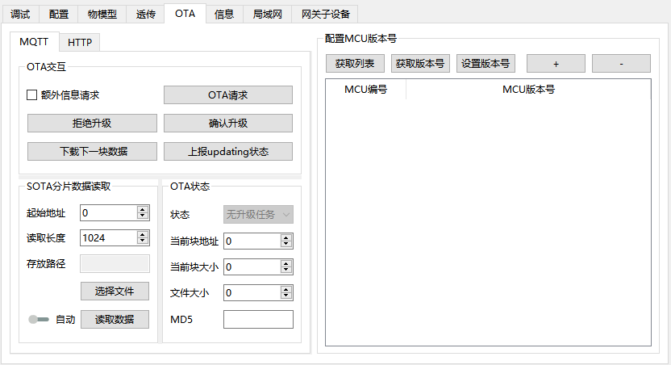
    
图26

### 6.1. MQTT
#### 6.1.1.OTA交互
在接收到云平台下发的升级任务时用于MQTT-OTA确认。

    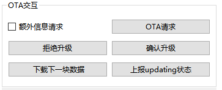
    
图27

1. OTA请求  
点击OTA请求，可获取当前平台匹配的计划。
    > 注点击前面的“额外信息请求”的复选框则可在OTA请求时附带sha256的固件校验信息。
2. 拒绝升级  
拒绝当前下发的升级任务。
3. 确认升级  
接受当前下发的升级任务。
4. 下载下一块数据  
在MQTT-SOTA时，MQTT-SOTA固件过大被分包下载时，当前分包接收完成后命令模组开始下载下一包数据。
5. 上报updating状态  
在MQTT-SOTA时。固件下载完成并校验成功，进行固件更新状态时上报云平台更新状态。
6. MQTT-SOTA分片数据读取  

    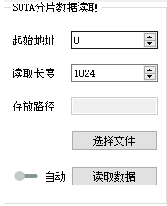
    
图28

* **起始地址：** 读取的文件偏移地址。
* **读取长度：** 读取的文件长度。
* **存放路径：** 用于选择SOTA固件读取数据中的存放路径。
* **自动：** 该选项被打开后，只需要点击一次“读取数据”，后续将自动完成下载流程并校验MD5。
#### 6.1.3.OTA状态

    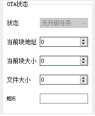
    
图29

* **状态：** 当前MQTT-OTA状态。
* **当前块地址：** 模组当前下载的固件块起始地址。
* **当前块大小：** 模组当前下载的固件块大小。
* **文件大小：** 模组当前下载的文件大小。
* **MD5：** 模组当前下载的文件MD5。
### 6.2.HTTP-OTA
OTA请求需要配置电量、通信版本当前为默认，URL和产品信息，再点击OTA请求。

    
    
图30

    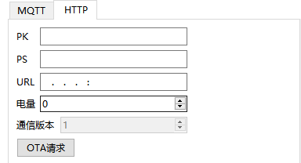
    
图31

### 6.3.配置MCU版本号

    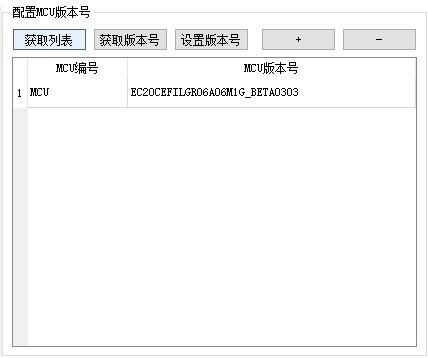
    
图32

1. **获取列表**  
获取模组当前保存的所有MCU编号及版本号，并更新到下方列表中。
2. **获取版本号**  
需要通过光标选中下方的MCU编号，再点击“获取版本号”，会获取到的版本号更新到下方的列表中。
3. **设置版本号**  
需要通过光标选中下方的MCU编号，并修改列表中对应的MCU版本号，在点击“设置版本号”，会把选中的MCU编号和版本号更新到模组中。
4. **增加MCU**  
点击按钮“+”，可以在列表中新增一个MCU编号和MCU版本号，并编辑。
5. **删除MCU**  
在列表中选中一个MCU，并点击按钮“-”，可以把选中的MCU从列表中删除，同时也删除了模组内部对应的MCU。
## 7 信息功能界面简介
切换到“信息”功能界面。

    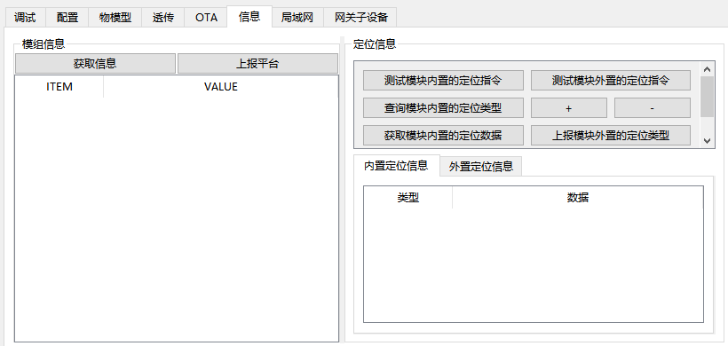
    
图33

### 7.1.获取信息
点击“获取信息”按钮后，会把获取到的模组信息在右侧“模组信息”列表中显示。
### 7.2.上报平台
点击“上报平台”按钮后，会命令模组把当前模组信息上报到云平台。
### 7.3.定位信息

    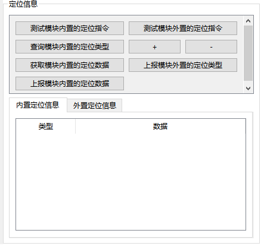
    
图34

#### 7.3.1.测试模块内置的定位指令

    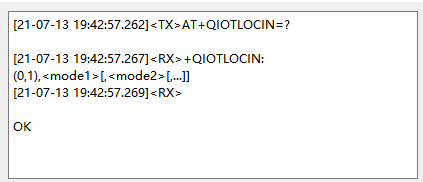
    
图35

调试窗口显示信息
#### 7.3.2.查询模块内置的定位类型
获取内置定位信息栏将显示可支持的定位类型。

    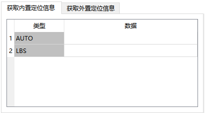
    
图36

#### 7.3.3.获取模块内置的定位数据
点击类型中的项，再点击获取模块内置的定位数据，则数据列将显示相应信息

    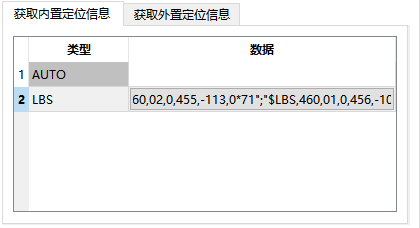
    
图37

再点击数据栏，将弹出下面的窗口，显示具体内容。

    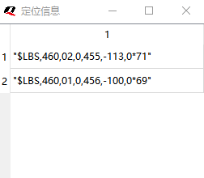
    
图38

#### 7.3.4.上报模块内置的定位数据
点击类型中的项，再点击“上报模块内置的定位数据”按钮完成上报。

#### 7.3.5.测试模块外置的定位指令
#### 7.3.6.+
点击+，将在 获取外置定位信息栏新增一栏,并点击类型栏进行编辑

    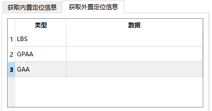
    
图39

#### 7.3.7.-
选中一到多栏待删除类型，再点击-，类型栏将删除相应栏。

    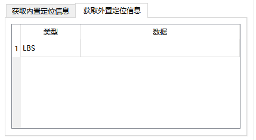
    
图40

#### 7.3.8.设置模块外置的定位类型
点击类型，再点击设置模块外置的定位类型，将发送信息给DMP，需已连接DMP。
## 8 局域网功能界面简介
切换到“局域网”功能界面。

    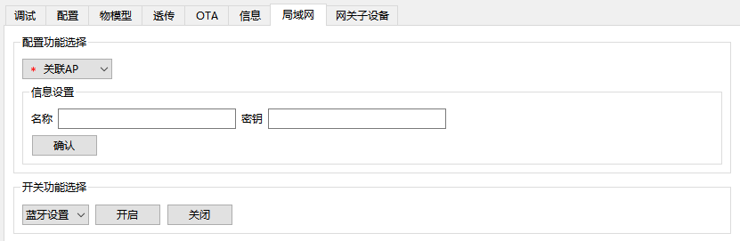
    
图41

### 8.1.功能选择
可选择 关联IP/WIFI配置/清除默认设置

    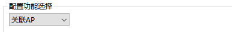
    
图42

### 8.2.关联AP
功能选择选择“关联AP”，信息设置填写AP名称和密钥，再点击确认进行连接。

    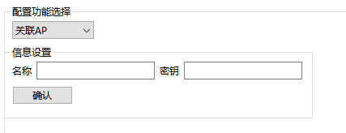
    
图43

### 8.3.WIFI配置
功能选择选择“WIFI配置”，信息设置填写WIFI名称和密钥，再点击确认进行连接。

    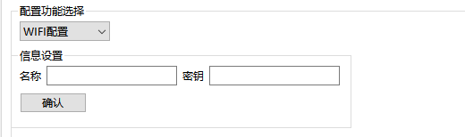
    
图44

### 8.4.清除默认设置
功能选择选择“清除默认设置”，再点击确认即可发送命令。

    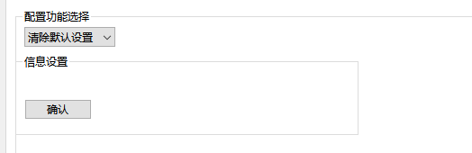
    
图45

### 8.5.蓝牙功能
点击“蓝牙功能”前的复选框，即可发送蓝牙连接，再点击则为关闭。

    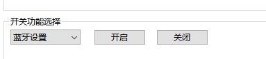
    
图46

## 9 网关子设备功能界面简介
切换到“网关子设备”功能界面。

    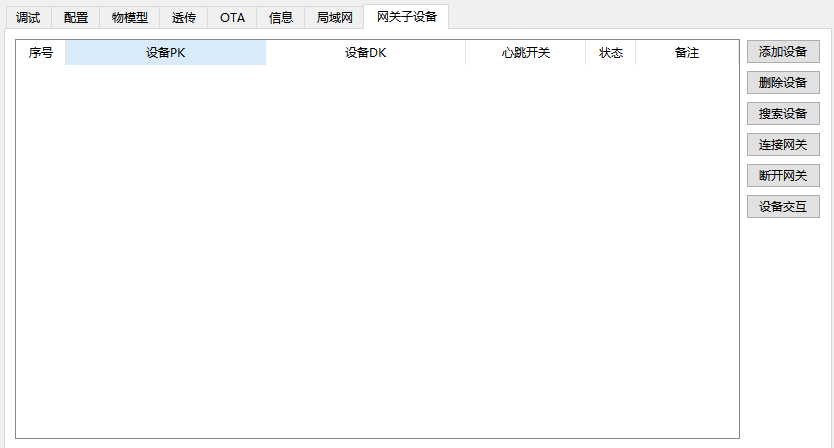
    
图47

### 9.1.添加设备
首次添加子设备时，若子设备未拥有DS，DS项可为空。

    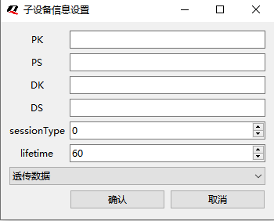
    
图48

### 9.2.删除设备

    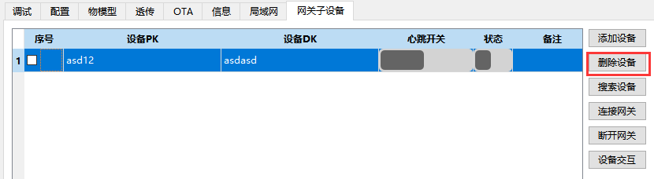
    
图49

### 9.3.搜索设备

    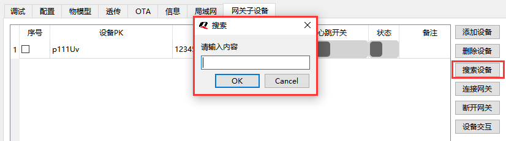
    
图50

### 9.4.连接网关
正确连接网关后，如图所示的结果，心跳开关和状态都将置为true。

    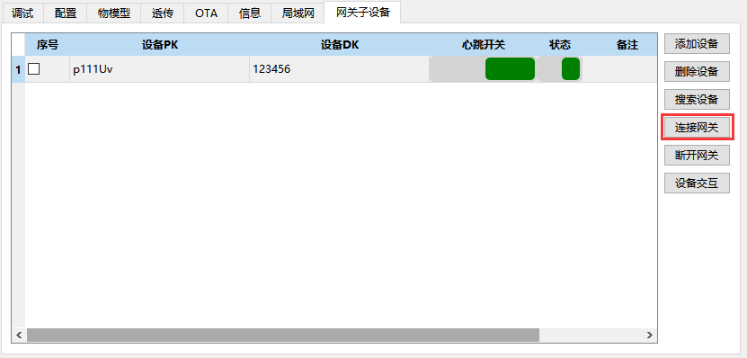
    
图51

### 9.5.设备交互
子设备交互界面包含三类信息：子设备信息：子设备DK、子设备DK以及子设备状态；子设备透传数据交互；子设备物模型数据交互。子设备透传数据和物模型数据交互界面与第四-五章节保持一致。

    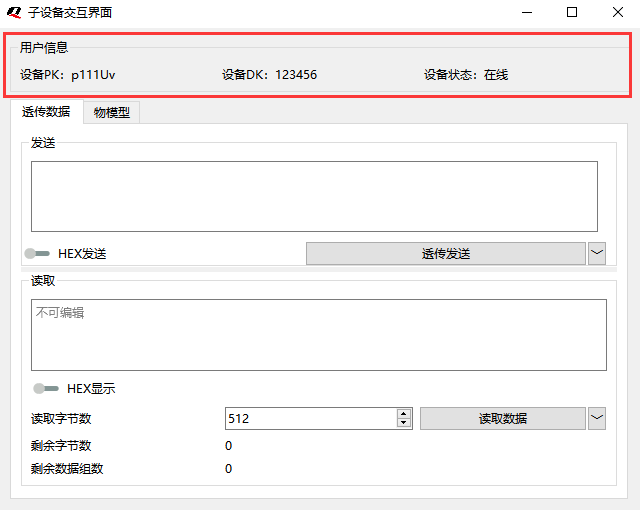
    
图52

## 10 用户简易使用教程
1. 步骤一：本教程将以TCP连接为例，用户首次打开程序时，如图所示，点击端口配置中的TCP选项，根据本机实际情况选择IP和端口号配置，配置完成后点击“打开TCP”按钮。

    
    
图53

若连接成功则“打开TCP”按钮的文本将改变为“关闭TCP”。

    
    
图54

2. 步骤二：点击配置界面，如图所示，点击功能配置界面的右上角的“+”按钮添加产品信息。

    
    
图55

后续添加产品的操作请参考第二章产品配置的操作说明。
3. 步骤三：如图所示，点击产品后点击右侧的设置，日志输出窗口将输出“OK”的结果。

    
    
图56

4. 步骤四：返回调试功能界面，点击开始连接，即可出现如下图所示的结果。

    
    
图57

5. 步骤五：当前设备已正常连接至平台，后续操作如：物模型交互、透传数据交互、AT指令交互、定位信息及产品信息交互均可通过相应的配置界面进行使用。